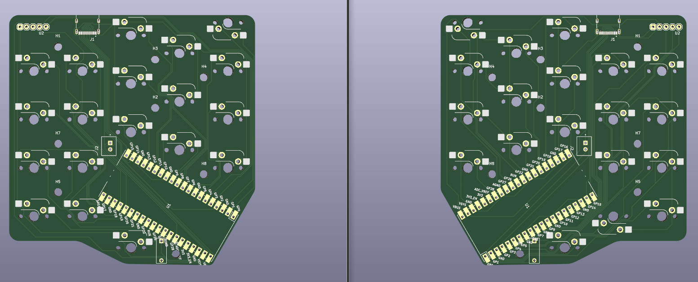

# Split Ergo Ortholinear Hotswap Keyboard 

This project attempts to create easelly reproducible split ortholinear  hotswap mechanical
keyboard. 

Gimmics: 
+ This design doesn't require any diodes
+ Uses PiPico as MC, runs on CircuitPython
+ Key layouts are changed by dragging a file onto PiPicos storrage
+ Halves are connected through TypeC
+ PCB fits into 100x100mm square, so it is very cheap to order from Chineese manifacturers

# Gallery

